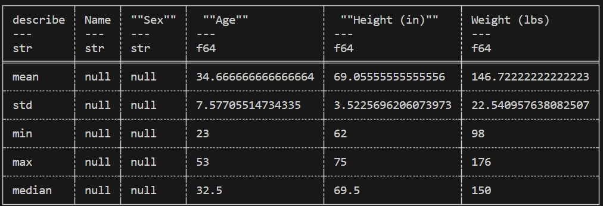
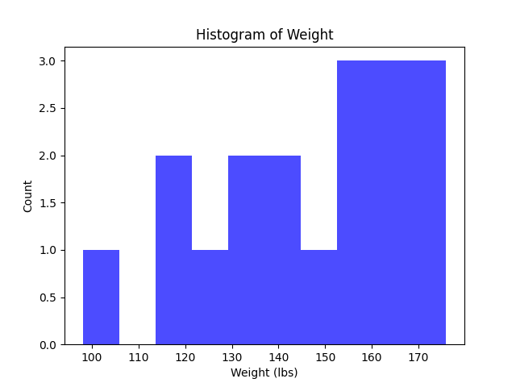

# IDS706_Fall2023_Mini_Project_3_Polars

Week 3 Mini Project Polars Descriptive Statistics Script

It contains the basic template elements:

- ``.devcontainer`` includes a `Dockerfile` that specifies the configurations of container, and a `devcontainer.json` which is a configuration file used in the context of Visual Studio Code

- ``workflows`` includes `GitHub Actions`, enables automated build, test and deployment for the project

- ``Makefile`` specifies build automation on Linux

- ``requirements.txt`` lists the dependencies, libraries, and specific versions of Python packages required for the project.   For this project, add `polars` to the requirements list - for compatibility, the version of polars is specified to `0.10.26`.

It also includes ``main.py`` and ``test_main.py`` as sample files to show the functionality of the CI pipeline.

- ``main.py`` imports ``polars`` library and uses `pl.read_csv()` to load the csv data `biostats.csv`, which contains statistics related to personal biometrics. It generates summary statistics including mean, median and standard deviation of each data column using ``data.describe()`` (See below). It then extracts the weights colomn and makes use of ``matplotlib`` to visualize the data by creating a histogram of the distribution of weight data.

- ``test_main.py`` contains a unit test related to a function defined in ``main.py``.

## Statistic Summary

## Data Visualization 

